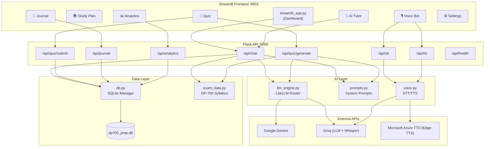

# 🚀 FabricPrep — DP-700 Exam Prep App

**AI-powered study buddy for the Microsoft DP-700: Implementing Data Engineering Solutions Using Microsoft Fabric certification.**

Crack the exam in 10 days with a GenZ-energy AI tutor, voice bot, smart journal, and adaptive quizzes!

## ✨ Features

| Feature | Description |
|---------|-------------|
| 🤖 **AI Tutor** | Chat with DP_Bot — powered by Gemini & Groq via LiteLLM |
| 🎙️ **Voice Bot** | Speak your questions, hear AI answers (Groq Whisper + Edge-TTS) |
| 📝 **Journal** | Markdown notes per module with AI summarization |
| 🧪 **Quiz Engine** | AI-generated MCQs targeting your weak areas |
| 📚 **Study Plan** | 10-day structured plan mapped to exam syllabus |
| 📊 **Analytics** | Score trends, weakness heatmap, exam readiness score |
| 🏆 **Final Mock Exam** | Full-length timed practice exam |
| ☀️ **Themes** | Full Light and Dark mode support across all components |

## 🛠️ Tech Stack

| Layer | Technology | Purpose |
|-------|-----------|---------|
| **Frontend** | Streamlit ≥1.45 | Multi-page UI with custom dark CSS |
| **Backend API** | Flask ≥3.1 | REST API running on `http://127.0.0.1:5050` |
| **AI Router** | LiteLLM ≥1.60 | Unified interface for Gemini & Groq with auto-fallback |
| **Primary LLM** | Gemini 2.0 Flash | Tutor chat, quiz generation, weakness analysis |
| **Fallback LLM** | Groq Llama 3.3 70B | Fast fallback model |
| **STT** | Groq Whisper Large v3 | Speech-to-text transcription |
| **TTS** | Edge-TTS + gTTS | Natural Microsoft neural voices (with gTTS fallback) |
| **Database** | SQLite (WAL mode) | Local persistence in `dp700_prep.db` |
| **Charts** | Plotly ≥6.0 | Analytics visualizations |
| **Env Mgmt** | python-dotenv ≥1.0 | `.env` file loading |

## 🚀 Quick Start

```bash
# 1. Clone and enter the project
cd DP700

# 2. Install dependencies
pip install -r requirements.txt

# 3. Set up API keys (copy .env.example to .env and fill in)
cp .env.example .env

# 4. Run the app
streamlit run streamlit_app.py
```

**The app opens at** `http://localhost:8501`
**Flask API auto-starts at** `http://127.0.0.1:5050`

## 🔑 API Keys Required (Both FREE!)

| Provider | Env Variable | Get Key | Used For |
|----------|-------------|---------|----------|
| **Google Gemini** | `GEMINI_API_KEY` | [Google AI Studio](https://aistudio.google.com/apikey) | AI Tutor, Quiz Gen, Summarization |
| **Groq** | `GROQ_API_KEY` | [Groq Console](https://console.groq.com/keys) | Fast AI Fallback + Voice Transcription |

> Keys can be set via `.env` file locally or via **Streamlit Secrets** when deployed to Streamlit Cloud.

## ☁️ Deploy to Streamlit Cloud

1. Push code to GitHub
2. Go to [share.streamlit.io](https://share.streamlit.io)
3. Deploy with `streamlit_app.py` as main file
4. Add secrets in dashboard:
   ```toml
   GEMINI_API_KEY = "your-key"
   GROQ_API_KEY = "your-key"
   ```

## 📁 Project Structure

```
DP700/
├── streamlit_app.py              # 🏠 Main entry — Dashboard with stats, quick actions, module progress
├── requirements.txt              # 📦 Python dependencies
├── .env                          # 🔑 API keys (gitignored)
├── .env.example                  # 🔑 Template for env vars
├── .gitignore                    # Git ignore rules
├── dp700_prep.db                 # 📀 SQLite database (auto-created, gitignored)
│
├── pages/                        # 📄 Streamlit multi-page app
│   ├── 1_📚_Study_Plan.py        #    10-day structured study plan
│   ├── 2_🤖_AI_Tutor.py          #    Chat with DP_Bot (LiteLLM)
│   ├── 3_🎙️_Voice_Bot.py         #    Voice input/output (Groq Whisper + gTTS)
│   ├── 4_📝_Journal.py           #    Markdown notes per module w/ AI summarization
│   ├── 5_🧪_Quiz.py              #    AI-generated adaptive MCQ quizzes
│   ├── 6_📊_Analytics.py         #    Score trends, weakness heatmap, readiness
│   └── 7_⚙️_Settings.py          #    API key management & model selection
│
├── ai/                           # 🧠 AI layer
│   ├── __init__.py
│   ├── llm_engine.py             #    LiteLLM wrapper — Gemini ↔ Groq auto-fallback
│   ├── prompts.py                #    System prompts (tutor, quiz gen, weakness analyzer, summarizer)
│   └── voice.py                  #    STT (Groq Whisper) + TTS (Edge-TTS + gTTS)
│
├── backend/                      # 🖥️ Flask REST API
│   ├── __init__.py
│   ├── app.py                    #    All API endpoints (chat, quiz, voice, journal, analytics)
│   └── server.py                 #    Starts Flask in a background daemon thread
│
├── database/                     # 💾 Persistence layer
│   ├── __init__.py
│   └── db.py                     #    SQLite manager with 5 tables
│
├── assets/                       # 🎨 Static assets
│   ├── __init__.py
│   ├── style.css                 #    Dark theme CSS (~12KB) with glassmorphism
│   └── exam_data.py              #    Full DP-700 syllabus — 10 modules with topics, tips, weights
│
├── .streamlit/
│   └── config.toml               #    Streamlit theme & server config
│
├── .devcontainer/
│   └── devcontainer.json         #    GitHub Codespaces / Dev Container config
│
├── test_qa.py                    #    QA smoke-test script (LLM, DB, TTS)
├── recover.py                    #    Recovery script (rebuilds files from agent transcript)
├── recover2.py                   #    Recovery script v2 (improved argument parsing)
└── change_color.py               #    Utility to batch-update color palette across codebase
```

## ⚙️ Architecture



## 💾 Database Schema

The SQLite database (`dp700_prep.db`) uses **WAL journal mode** for thread safety and contains 5 tables:

| Table | Purpose | Key Columns |
|-------|---------|-------------|
| `journal_entries` | User's study notes per module | `module_id`, `title`, `content`, `created_at` |
| `chat_history` | AI Tutor conversation log | `module_id`, `role` (user/assistant), `content`, `model_used` |
| `quiz_results` | Quiz scores & question data | `module_id`, `quiz_type` (module/final), `score`, `total`, `questions_data` (JSON) |
| `study_progress` | Module completion tracking | `module_id` (UNIQUE), `status` (not_started/in_progress/completed), `time_spent_mins` |
| `user_weaknesses` | Weak topic tracking | `module_id`, `topic`, `weakness_score` (0.0–1.0), `identified_from` |

## 🌐 Flask API Endpoints

| Method | Endpoint | Description |
|--------|----------|-------------|
| `GET` | `/api/health` | Health check + API key status |
| `POST` | `/api/chat` | Send message to AI Tutor, get response |
| `POST` | `/api/quiz/generate` | Generate adaptive MCQ quiz |
| `POST` | `/api/quiz/submit` | Submit quiz answers, get score & weaknesses |
| `POST` | `/api/stt` | Speech-to-text (audio file upload) |
| `POST` | `/api/tts` | Text-to-speech (returns MP3 audio) |
| `GET` | `/api/journal` | List journal entries (optional `?module_id=`) |
| `POST` | `/api/journal` | Create/update journal entry |
| `DELETE` | `/api/journal/<id>` | Delete journal entry |
| `POST` | `/api/journal/summarize` | AI-summarize journal notes |
| `GET` | `/api/progress` | Get all module progress |
| `PUT` | `/api/progress` | Update module progress |
| `GET` | `/api/analytics` | Full analytics (summary, quizzes, weaknesses, progress) |
| `GET` | `/api/weaknesses` | Get weakness areas (optional `?module_id=`) |

## 📚 Exam Syllabus (10-Day Plan)

Defined in `assets/exam_data.py` — 10 modules mapped to the official DP-700 objectives:

| Day | Module | Weight | Domain |
|-----|--------|--------|--------|
| 1 | 🔄 Ingest Data — Pipelines | ~15% | Ingest & Transform |
| 2 | 🌊 Ingest Data — Dataflows & Shortcuts | ~10% | Ingest & Transform |
| 3 | ⚡ Transform Data — Spark & PySpark | ~15% | Ingest & Transform |
| 4 | 📊 Transform Data — T-SQL & KQL | ~10% | Ingest & Transform |
| 5 | 🏠 Design — Lakehouse Architecture | ~10% | Implement & Manage |
| 6 | 🏗️ Design — Warehouse & Data Modeling | ~10% | Implement & Manage |
| 7 | 🔒 Security & Governance | ~10% | Implement & Manage |
| 8 | 📈 Monitor & Optimize | ~10% | Monitor & Optimize |
| 9 | 🔗 End-to-End & CI/CD | ~5% | Monitor & Optimize |
| 10 | 🏆 Final Mock Exam | 100% | All Domains |

## 🔧 Key Design Decisions

1. **Flask runs as a daemon thread** inside the Streamlit process — no separate server needed. The `server.py` launcher checks if the server is already running before starting, with a 15-second timeout.
2. **LiteLLM as a unified router** — one API for multiple LLM providers. Model switching is seamless with automatic fallback if the primary model fails.
3. **Adaptive quiz generation** — quizzes factor in the student's chat history (questions they asked = confusion areas) and past quiz weaknesses to focus on weak topics.
4. **SQLite with WAL mode** — enables concurrent reads from Streamlit while Flask writes, avoiding locking issues.
5. **GenZ + Alakh Pandey persona** — the tutor prompt blends casual GenZ English with Hindi encouragement to create an engaging learning experience.

---

**Built with 💜 for aspiring Fabric Data Engineers**
